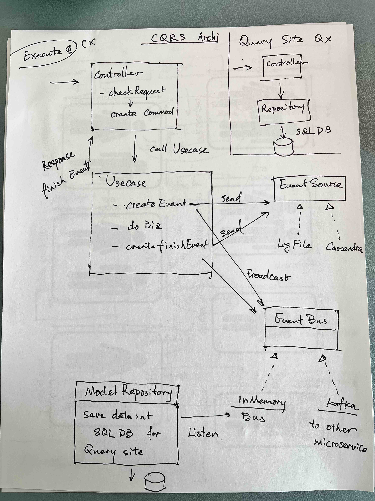

# E-Commerce Microservices

A sample e-commerce application built with microservices architecture.

## Architecture


## CQRS Workflow



## Modules


## Running the User Service

The User Service is a Spring Boot microservice that handles user authentication and management.

### Prerequisites
- Java 21
- Gradle (or use the included wrapper)

### Steps to Run

1. Navigate to the user service directory:
   ```bash
   cd services/ec-user-service
   ```

2. Run the service using Gradle wrapper:
   ```bash
   ./gradlew bootRun
   ```

3. The service will start on `http://localhost:8081`

### Features
- **H2 Database**: In-memory database (accessible at `/h2-console`)
- **JWT Authentication**: Token-based authentication with configurable expiration
- **Event Sourcing**: Events logged to `./data/events.log`
- **REST API**: User registration, login, and management endpoints

### Useful Commands
- **Build**: `./gradlew build`
- **Run Tests**: `./gradlew test`
- **Clean Build**: `./gradlew clean build`
